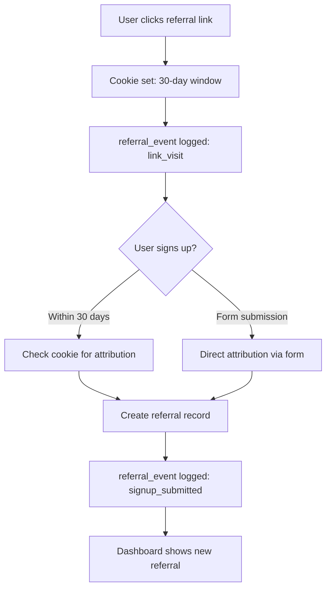

# Refer Labs Referral System - Complete Guide

## 📋 Table of Contents
1. [Admin Referral Page QA Checklist](#admin-referral-page-qa-checklist)
2. [System Architecture Overview](#system-architecture-overview)
3. [Setting Up Referral Pages for New Businesses](#setting-up-referral-pages-for-new-businesses)
4. [Testing & Troubleshooting](#testing--troubleshooting)
5. [Advanced Configuration](#advanced-configuration)

---

## 🎯 Admin Referral Page QA Checklist

### Primary Page: https://referlabs.com.au/referral

#### ✅ Visual Elements
- [ ] **Hero Section**
  - [ ] Gradient background displays correctly
  - [ ] "Exclusive Referral Program" badge visible
  - [ ] Main heading renders: "Earn 25% Recurring Revenue"
  - [ ] Subheading displays: "For Every Business You Refer"
  - [ ] Stats cards show correct values (500+, 2,400+, $850, $4,200/mo)
  - [ ] All text is readable on all screen sizes (mobile, tablet, desktop)

- [ ] **Benefits Section**
  - [ ] All 4 benefit cards render correctly
  - [ ] Icons display properly (DollarSign, Gift, BarChart3, Zap)
  - [ ] Gradient backgrounds on icon containers
  - [ ] Hover effects work on cards
  - [ ] Text is properly aligned and readable

- [ ] **How It Works Section**
  - [ ] 3 numbered steps display in correct order
  - [ ] Connecting lines appear between steps (desktop only)
  - [ ] Step numbers have gradient backgrounds
  - [ ] Text explains process clearly

- [ ] **Referral Link Section**
  - [ ] Admin referral link displays: `https://referlabs.com.au/r/Jn9wjbn2kQlO`
  - [ ] "Visit Link" button is styled correctly
  - [ ] "Automatic attribution enabled" badge shows with checkmark
  - [ ] Card has proper shadow and border

- [ ] **Program Details Section**
  - [ ] All 5 detail cards render
  - [ ] Green checkmarks display on all cards
  - [ ] Text is clear and informative

- [ ] **CTA Section**
  - [ ] Final call-to-action card displays
  - [ ] Gradient background visible
  - [ ] Both buttons render correctly
  - [ ] Links point to correct destinations

#### ✅ Interactive Elements

- [ ] **Navigation**
  - [ ] "Get Your Referral Link" button → `/r/Jn9wjbn2kQlO`
  - [ ] "Access Dashboard" button → `/login`
  - [ ] "View Full Dashboard" button → `/login`
  - [ ] "Get Started Now" button → `/r/Jn9wjbn2kQlO`
  - [ ] "Questions? Contact Us" button → `/contact`
  - [ ] "Visit Link" button → Opens referral page in new tab

- [ ] **Link Functionality**
  - [ ] All buttons are clickable
  - [ ] External links open in new tabs (where appropriate)
  - [ ] No broken links (404 errors)
  - [ ] Hover states work on all buttons

#### ✅ Responsive Design

- [ ] **Mobile (< 640px)**
  - [ ] Stats stack vertically (2 columns)
  - [ ] Buttons stack vertically
  - [ ] Text remains readable
  - [ ] No horizontal scrolling
  - [ ] Referral link code wraps properly

- [ ] **Tablet (640px - 1024px)**
  - [ ] Benefits cards display in 2 columns
  - [ ] How It Works steps stack appropriately
  - [ ] Navigation buttons side-by-side

- [ ] **Desktop (> 1024px)**
  - [ ] Stats display in 4 columns
  - [ ] Benefits in 2 columns
  - [ ] How It Works in 3 columns with connecting lines
  - [ ] Proper max-width container (7xl)

---

## 🏗️ System Architecture Overview

### Database Schema

```sql
-- Businesses Table (main)
CREATE TABLE businesses (
  id UUID PRIMARY KEY DEFAULT uuid_generate_v4(),
  owner_id UUID REFERENCES auth.users(id),
  name TEXT NOT NULL,
  offer_text TEXT,
  reward_type TEXT DEFAULT 'credit',
  reward_amount NUMERIC DEFAULT 15,
  client_reward_text TEXT,
  new_user_reward_text TEXT,
  reward_terms TEXT,
  logo_url TEXT,
  brand_highlight_color TEXT DEFAULT '#0abab5',
  brand_tone TEXT DEFAULT 'modern',
  site_url TEXT,
  onboarding_metadata JSONB,
  created_at TIMESTAMPTZ DEFAULT NOW()
);

-- Customers Table (ambassadors/referrers)
CREATE TABLE customers (
  id UUID PRIMARY KEY DEFAULT uuid_generate_v4(),
  business_id UUID REFERENCES businesses(id) ON DELETE CASCADE,
  name TEXT,
  email TEXT,
  phone TEXT,
  company TEXT,
  website TEXT,
  referral_code TEXT UNIQUE NOT NULL, -- Used in /r/[code]
  discount_code TEXT UNIQUE,
  status TEXT DEFAULT 'pending', -- active|pending|applicant
  credits NUMERIC DEFAULT 0,
  source TEXT,
  notes TEXT,
  instagram_handle TEXT,
  linkedin_handle TEXT,
  audience_profile TEXT,
  created_at TIMESTAMPTZ DEFAULT NOW(),
  updated_at TIMESTAMPTZ DEFAULT NOW()
);

-- Referrals Table (tracks referred users)
CREATE TABLE referrals (
  id UUID PRIMARY KEY DEFAULT uuid_generate_v4(),
  business_id UUID REFERENCES businesses(id) ON DELETE CASCADE,
  ambassador_id UUID REFERENCES customers(id) ON DELETE SET NULL,
  campaign_id TEXT,
  referred_name TEXT,
  referred_phone TEXT,
  referred_email TEXT,
  status TEXT DEFAULT 'pending', -- pending|completed|cancelled
  transaction_value NUMERIC,
  consent_given BOOLEAN DEFAULT false,
  locale TEXT DEFAULT 'en',
  metadata JSONB,
  created_at TIMESTAMPTZ DEFAULT NOW(),
  completed_at TIMESTAMPTZ
);

-- Referral Events Table (analytics/tracking)
CREATE TABLE referral_events (
  id UUID PRIMARY KEY DEFAULT uuid_generate_v4(),
  business_id UUID REFERENCES businesses(id) ON DELETE CASCADE,
  ambassador_id UUID REFERENCES customers(id) ON DELETE SET NULL,
  event_type TEXT NOT NULL, -- link_visit|signup_submitted|conversion|etc
  source TEXT, -- utm_source or campaign_id
  device TEXT, -- mobile|desktop|tablet
  metadata JSONB, -- UTM params, referrer, etc.
  created_at TIMESTAMPTZ DEFAULT NOW()
);

CREATE INDEX idx_referral_events_business ON referral_events(business_id);
CREATE INDEX idx_referral_events_ambassador ON referral_events(ambassador_id);
CREATE INDEX idx_referral_events_type ON referral_events(event_type);
```

### URL Structure

```
/referral
  ↓
  Main landing page for Refer Labs referral program
  Shows admin's link: https://referlabs.com.au/r/Jn9wjbn2kQlO

/r/[code]
  ↓
  Individual referral pages for each customer
  Example: /r/Jn9wjbn2kQlO (Admin's page)
  Example: /r/xIP0b1MCwsQt (Another user's page)

/r/referral?code=[code]
  ↓
  Fallback page if code is invalid
  Shows project-specific landing with optional ambassador preview
```

### Attribution Flow



---

## 🚀 Setting Up Referral Pages for New Businesses

### Step 1: Create Business Account

When a new business signs up on `/login`, they automatically get:
- A business record in the `businesses` table
- An owner_id linked to their auth.users account

### Step 2: Create Customer Record (Ambassador)

To give the business owner a referral link, create a customer record:

```javascript
// scripts/create-business-referral.js
import { createClient } from '@supabase/supabase-js';
import { nanoid } from 'nanoid';

const supabase = createClient(
  process.env.NEXT_PUBLIC_SUPABASE_URL,
  process.env.SUPABASE_SERVICE_ROLE_KEY
);

async function createBusinessReferral(businessId, ownerEmail, ownerName) {
  const referralCode = nanoid(12);
  const discountCode = generateDiscountCode(ownerName);

  const { data, error } = await supabase
    .from('customers')
    .insert([{
      business_id: businessId,
      name: ownerName,
      email: ownerEmail,
      referral_code: referralCode,
      discount_code: discountCode,
      status: 'active',
      source: 'business_owner',
    }])
    .select()
    .single();

  if (error) throw error;

  console.log(`✅ Referral link: https://referlabs.com.au/r/${referralCode}`);
  return data;
}

function generateDiscountCode(name) {
  const adjectives = ['Plus', 'Prime', 'Elite', 'Pro', 'VIP'];
  const suffix = adjectives[Math.floor(Math.random() * adjectives.length)];
  const num = Math.floor(Math.random() * 99) + 1;
  return `${name.split(' ')[0]}${suffix}${num}`;
}
```

### Step 3: Customize Referral Page

The `/r/[code]` page automatically:
- Pulls business branding from the `businesses` table
- Uses `logo_url` if provided
- Applies `brand_highlight_color` for gradients
- Shows `offer_text`, `client_reward_text`, `new_user_reward_text`

**Example: Update business branding**

```javascript
// Update business settings
await supabase
  .from('businesses')
  .update({
    logo_url: 'https://yourdomain.com/logo.png',
    brand_highlight_color: '#7c3aed', // Purple
    offer_text: '$20 credit',
    client_reward_text: '$15 credit',
    new_user_reward_text: '$20 credit',
    reward_terms: 'Credit applied after first purchase',
  })
  .eq('id', businessId);
```

### Step 4: Share Referral Link

The business owner can now share:
```
https://referlabs.com.au/r/[their-referral-code]
```

**Example for a spa business:**
```
https://referlabs.com.au/r/abc123xyz
```

This page will:
- Show the spa's logo
- Display spa's offer text
- Use spa's brand colors
- Track all referrals to the spa owner's customer record

### Step 5: Track Referrals in Dashboard

Referrals appear in `/dashboard` under:
- **Step 4: Track Campaigns** - View all referrals
- **Step 5: Measure ROI** - Analytics and earnings

---

## 🧪 Testing & Troubleshooting

### Test Checklist for New Business

```bash
# 1. Create test business and customer
node scripts/create-business-referral.js

# 2. Visit referral page
# Replace CODE with the generated referral_code
open https://referlabs.com.au/r/CODE

# 3. Verify page elements
✓ Business logo displays (if set)
✓ Offer text shows correctly
✓ Brand colors applied
✓ Referral form submits successfully

# 4. Submit test referral
# Fill out form on /r/CODE with test data

# 5. Check database
psql> SELECT * FROM referrals WHERE ambassador_id = '[customer-id]';
psql> SELECT * FROM referral_events WHERE ambassador_id = '[customer-id]';

# 6. Verify dashboard
# Sign in as business owner
# Navigate to Step 4: Track Campaigns
# Confirm referral appears in list
```

### Common Issues & Solutions

#### Issue: Referral page shows "not found"
**Cause:** Invalid or missing referral_code
**Solution:**
```sql
SELECT referral_code FROM customers WHERE email = '[user-email]';
```
If NULL, generate one:
```javascript
const code = nanoid(12);
await supabase.from('customers').update({ referral_code: code }).eq('id', customerId);
```

#### Issue: Attribution not working
**Cause:** Cookies blocked or cross-domain issues
**Solution:**
1. Check browser allows cookies
2. Verify NEXT_PUBLIC_SITE_URL is set correctly
3. Test in incognito mode
4. Use form submission (direct attribution) instead of cookie

#### Issue: Wrong business branding shown
**Cause:** Customer linked to wrong business_id
**Solution:**
```sql
SELECT c.*, b.name as business_name
FROM customers c
JOIN businesses b ON c.business_id = b.id
WHERE c.referral_code = '[code]';
```

#### Issue: Referrals not appearing in dashboard
**Cause:** Referral linked to different ambassador_id
**Solution:**
```sql
SELECT * FROM referrals WHERE referred_phone = '[test-phone]';
-- Check ambassador_id matches expected customer
```

---

## 🔧 Advanced Configuration

### Custom Domain Setup

To use a custom domain (e.g., `spa.com/refer/ABC123`):

1. **Update site_url in businesses table:**
```javascript
await supabase
  .from('businesses')
  .update({ site_url: 'https://spa.com' })
  .eq('id', businessId);
```

2. **Deploy referral page to custom domain:**
```javascript
// pages/refer/[code]/page.tsx
export default async function CustomReferralPage({ params }) {
  // Same logic as /r/[code]/page.tsx
  // But uses spa.com branding
}
```

3. **Update referral link generation:**
```javascript
const siteOrigin = business.site_url || 'https://referlabs.com.au';
const referralUrl = `${siteOrigin}/refer/${referralCode}`;
```

### Multi-Language Support

The system already supports EN/ES. To add more languages:

```javascript
// In /r/[code]/page.tsx
const localeCopy = {
  en: { /* English copy */ },
  es: { /* Spanish copy */ },
  fr: { /* Add French */ },
  de: { /* Add German */ },
};

// Use query param: /r/CODE?lang=fr
```

### Custom Tracking Parameters

Track marketing campaigns with UTM parameters:

```
https://referlabs.com.au/r/CODE?utm_source=facebook&utm_campaign=spring-launch
```

Stored in `referral_events.metadata`:
```json
{
  "query": {
    "utm_source": "facebook",
    "utm_campaign": "spring-launch"
  },
  "referrer": "https://facebook.com",
  "locale": "en"
}
```

### Webhook Notifications

Set up webhooks to notify external systems:

```javascript
// After referral submission
await fetch('https://your-system.com/webhook/referral', {
  method: 'POST',
  headers: { 'Content-Type': 'application/json' },
  body: JSON.stringify({
    event: 'referral.submitted',
    referral_code: ambassadorCode,
    referred_name: referredName,
    referred_phone: referredPhone,
    timestamp: new Date().toISOString(),
  }),
});
```

---

## 📊 Analytics & Reporting

### Key Metrics to Track

1. **Link Visits** (`event_type: 'link_visit'`)
2. **Form Submissions** (`event_type: 'signup_submitted'`)
3. **Conversion Rate** (submissions / visits)
4. **Active Ambassadors** (customers with status='active')
5. **Total Referrals** (count of referrals table)
6. **Revenue Attribution** (sum of transaction_value)

### Query Examples

**Top performers:**
```sql
SELECT
  c.name,
  c.email,
  COUNT(r.id) as total_referrals,
  SUM(r.transaction_value) as total_revenue
FROM customers c
LEFT JOIN referrals r ON c.id = r.ambassador_id
GROUP BY c.id
ORDER BY total_referrals DESC
LIMIT 10;
```

**Conversion funnel:**
```sql
SELECT
  COUNT(CASE WHEN event_type = 'link_visit' THEN 1 END) as visits,
  COUNT(CASE WHEN event_type = 'signup_submitted' THEN 1 END) as signups,
  ROUND(
    COUNT(CASE WHEN event_type = 'signup_submitted' THEN 1 END)::NUMERIC /
    NULLIF(COUNT(CASE WHEN event_type = 'link_visit' THEN 1 END), 0) * 100,
    2
  ) as conversion_rate
FROM referral_events
WHERE business_id = '[business-id]'
AND created_at > NOW() - INTERVAL '30 days';
```

---

## 🎯 Production Checklist

Before launching referral program for a new business:

- [ ] Business record created in database
- [ ] Customer record created with `referral_code`
- [ ] Business logo uploaded (optional)
- [ ] Brand colors configured (optional)
- [ ] Offer text and reward text set
- [ ] Test referral link: `https://referlabs.com.au/r/[CODE]`
- [ ] Submit test referral via form
- [ ] Verify referral appears in dashboard
- [ ] Check email notifications sent (if enabled)
- [ ] Test on mobile, tablet, desktop
- [ ] Verify analytics tracking
- [ ] Train business owner on dashboard
- [ ] Provide marketing materials (QR codes, social media graphics)

---

## 📞 Support

For issues or questions:
- **Email:** jarred@referlabs.com.au
- **Dashboard:** https://referlabs.com.au/dashboard
- **Documentation:** This file

---

## 🔄 Version History

- **v1.0.0** (2025-12-16): Initial referral system with admin page
- **v1.1.0** (2025-12-16): Added email notifications and chatbot lead capture
- **v1.2.0** (2025-12-16): Complete referral page redesign and QA documentation

---

## ✨ Quick Reference

### Admin Referral Details (jarred@referlabs.com.au)
- **Referral Code:** `Jn9wjbn2kQlO`
- **Discount Code:** `JarredElite21`
- **Referral Link:** https://referlabs.com.au/r/Jn9wjbn2kQlO
- **Landing Page:** https://referlabs.com.au/referral

### Key Files
- `/src/app/referral/page.tsx` - Main referral program landing
- `/src/app/r/[code]/page.tsx` - Individual referral pages
- `/src/lib/referrals.ts` - Referral submission logic
- `/src/lib/referral-events.ts` - Event tracking
- `/scripts/create-admin-referral.js` - Admin setup script
- `/scripts/get-jarred-referral-code.js` - Verify admin code

### Database Tables
- `businesses` - Business accounts
- `customers` - Ambassadors/referrers
- `referrals` - Referred users
- `referral_events` - Analytics tracking
